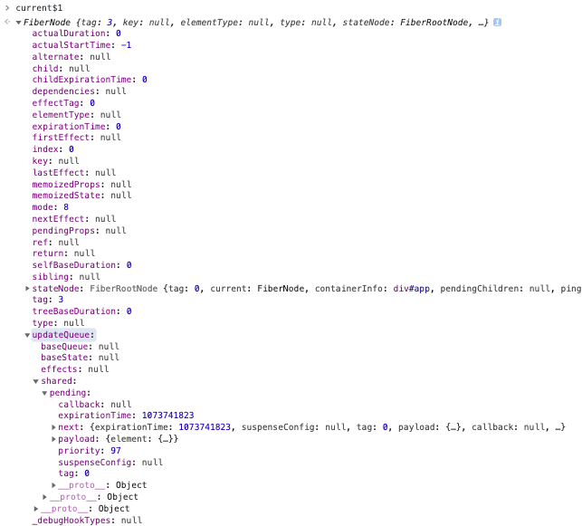

# ReactDOM.render工作机制

> *以下分析基于React, ReactDOM 16.13.1版本*


## 源码流程分析

```js
class App extends React.PureComponent {
  state = {
    username: 'shell',
  }

  render() {
    return <div className="container">
      <h1>hello { this.state.username }</h1>
      <p>i am children p element</p>
    </div>
  }
}

ReactDOM.render(<App />, document.getElementById('app'));
```

在使用React进行渲染之前，都是首先要去使用render函数来进行首次的渲染，接下去就去看下render函数做了什么。

```js
export function render(
  // <App />
  element: React$Element<any>,
  // #app
  container: Container,
  callback: ?Function,
) {
  return legacyRenderSubtreeIntoContainer(
    null,
    element,
    container,
    false,
    callback,
  );
}
```

其实就是调用了legacyRenderSubtreeIntoContainer函数，并且设置了一些默认值并且透传上面的参数

```js
function legacyRenderSubtreeIntoContainer(
  // null,
  parentComponent: ?React$Component<any, any>,
  // <App />,
  children: ReactNodeList,
  // #app,
  container: Container,
  // true
  forceHydrate: boolean,
  callback: ?Function,
) {
  let root: RootType = (container._reactRootContainer: any);
  let fiberRoot;
  if (!root) {
    // Initial mount
    root = container._reactRootContainer = legacyCreateRootFromDOMContainer(
      container,
      forceHydrate,
    );
    fiberRoot = root._internalRoot;
    // ...
    // Initial mount should not be batched.
    unbatchedUpdates(() => {
      updateContainer(children, fiberRoot, parentComponent, callback);
    });
  } else {
    // ...
  }
}
```

首先会从container节点，也就是render函数的第二个参数上，去获取_reactRootContainer属性，从而来判断是创建还是更新，创建的情况下root是没有值的，那么通过legacyCreateRootFromDOMContainer来创建root节点

```js
function legacyCreateRootFromDOMContainer(
  container: Container,
  forceHydrate: boolean,
): RootType {
  const shouldHydrate =
    forceHydrate || shouldHydrateDueToLegacyHeuristic(container);
  if (!shouldHydrate) {
    let warned = false;
    let rootSibling;
    while ((rootSibling = container.lastChild)) {
      container.removeChild(rootSibling);
    }
  }

  return createLegacyRoot(
    container,
    shouldHydrate
      ? {
          hydrate: true,
        }
      : undefined,
  );
}
```

由于我们是通过render函数调用的，那么就在legacyCreateRootFromDOMContainer函数中shouldHydrate是false，会去把container节点下面的子节点全部删除，接下去通过createLegacyRoot创建Root。

```js
export function createLegacyRoot(
  container: Container,
  options?: RootOptions,
): RootType {
  return new ReactDOMBlockingRoot(container, LegacyRoot, options);
}

function ReactDOMBlockingRoot(
  container: Container,
  tag: RootTag,
  options: void | RootOptions,
) {
  this._internalRoot = createRootImpl(container, tag, options);
}

function createRootImpl(
  container: Container,
  tag: RootTag,
  options: void | RootOptions,
) {
  // ...
  const root = createFiberRoot(container, tag, hydrate, hydrationCallbacks);
  // ...
  // ...
  return root;
}

export function createFiberRoot(
  containerInfo: any,
  tag: RootTag,
  hydrate: boolean,
  hydrationCallbacks: null | SuspenseHydrationCallbacks,
): FiberRoot {
  const root: FiberRoot = (new FiberRootNode(containerInfo, tag, hydrate): any);
  // ...
  const uninitializedFiber = createHostRootFiber(tag);
  root.current = uninitializedFiber;
  uninitializedFiber.stateNode = root;

  initializeUpdateQueue(uninitializedFiber);

  return root;
}
```

接下去在createLegacyRoot中实例化ReactDOMBlockingRoot这个类，并且在它的构造函数中才去真正的创建Root，并且赋值给ReactDOMBlockingRoot._internalRoot，最终在createFiberRoot才真正的去创建FiberRoot节点，接着创建HostRootFiber节点，并且把FiberRoot.current指向HostRootFiber节点，HostRootFiber的stateNode指向FiberRoot,接着HostRootFiber上初始化updateQueue, 最后返回FiberRoot，赋值给container节点的_reactRootContainer属性。

到这里位置创建了两个Fiber节点，分别是FiberRootNode和HostRootFiber，数据结构如图

```js
function FiberRootNode(containerInfo, tag, hydrate) {
  this.tag = tag;
  this.current = null;
  this.containerInfo = containerInfo;
  this.pendingChildren = null;
  this.pingCache = null;
  this.finishedExpirationTime = NoWork;
  this.finishedWork = null;
  this.timeoutHandle = noTimeout;
  this.context = null;
  this.pendingContext = null;
  this.hydrate = hydrate;
  this.callbackNode = null;
  this.callbackPriority_old = NoPriority;
  this.firstPendingTime = NoWork;
  this.lastPendingTime = NoWork;
  this.firstSuspendedTime = NoWork;
  this.lastSuspendedTime = NoWork;
  this.nextKnownPendingLevel = NoWork;
  this.lastPingedTime = NoWork;
  this.lastExpiredTime = NoWork;
  this.mutableSourceLastPendingUpdateTime = NoWork;
  // ...
}
```

```js
function FiberNode(
  tag: WorkTag,
  pendingProps: mixed,
  key: null | string,
  mode: TypeOfMode,
) {
  // Instance
  this.tag = tag;
  this.key = key;
  this.elementType = null;
  this.type = null;
  this.stateNode = null;

  // Fiber
  this.return = null;
  this.child = null;
  this.sibling = null;
  this.index = 0;

  this.ref = null;

  this.pendingProps = pendingProps;
  this.memoizedProps = null;
  this.updateQueue = null;
  this.memoizedState = null;
  this.dependencies_old = null;

  this.mode = mode;

  // Effects
  this.effectTag = NoEffect;
  this.nextEffect = null;

  this.firstEffect = null;
  this.lastEffect = null;

  this.expirationTime = NoWork;
  this.childExpirationTime = NoWork;

  this.alternate = null;
  // ...
}
```


接着回到legacyRenderSubtreeIntoContainer函数中，接着调用了unbatchedUpdates和updateContainer，首先来看unbatchedUpdates的实现

```js
const NoContext = /*                    */ 0b0000000;
const BatchedContext = /*               */ 0b0000001;
const EventContext = /*                 */ 0b0000010;
const DiscreteEventContext = /*         */ 0b0000100;
const LegacyUnbatchedContext = /*       */ 0b0001000;
const RenderContext = /*                */ 0b0010000;
const CommitContext = /*                */ 0b0100000;
const RetryAfterError = /*              */ 0b1000000;

let executionContext = NoContext;

export function unbatchedUpdates<A, R>(fn: (a: A) => R, a: A): R {
  const prevExecutionContext = executionContext;
  executionContext &= ~BatchedContext;
  executionContext |= LegacyUnbatchedContext;
  try {
    return fn(a);
  } finally {
    executionContext = prevExecutionContext;
    if (executionContext === NoContext) {
      flushSyncCallbackQueue();
    }
  }
}
```

代码不多，就是执行了传入的回调函数，并且对executionContext这个全局变量通过二进制的计算进行赋值，运行结束以后恢复到原本的executionContext，这里就是简单的把executionContext改为了LegacyUnbatchedContext，后续同一个调用栈中的属性就都是LegacyUnbatchedContext了。


```js
export function updateContainer(
  element: ReactNodeList,
  container: OpaqueRoot,
  parentComponent: ?React$Component<any, any>,
  callback: ?Function,
): ExpirationTime {
  // HostRootFiber
  const current = container.current;
  const currentTime = requestCurrentTimeForUpdate();
  const expirationTime = computeExpirationForFiber(
    currentTime,
    current,
    suspenseConfig,
  );

  if (container.context === null) {
    container.context = context;
  } else {
    // ...
  }

  const update = createUpdate(expirationTime, suspenseConfig);
  update.payload = {element};

  enqueueUpdate(current, update);
  scheduleUpdateOnFiber(current, expirationTime);

  return expirationTime;
}
```

```js
export function createUpdate(
  expirationTime: ExpirationTime,
  suspenseConfig: null | SuspenseConfig,
): Update<*> {
  const update: Update<*> = {
    expirationTime,
    suspenseConfig,

    tag: UpdateState,
    payload: null,
    callback: null,

    next: null,
  };
  return update;
}

export function enqueueUpdate<State>(fiber: Fiber, update: Update<State>) {
  const updateQueue = fiber.updateQueue;
  if (updateQueue === null) {
    // Only occurs if the fiber has been unmounted.
    return;
  }

  const sharedQueue: SharedQueue<State> = (updateQueue: any).shared;
  const pending = sharedQueue.pending;
  if (pending === null) {
    // This is the first update. Create a circular list.
    update.next = update;
  } else {
    update.next = pending.next;
    pending.next = update;
  }
  sharedQueue.pending = update;
}
```

在调用updateContainer的时候，已经创建好了两个fiber节点，container上的current指向HostRootFiber，接着创建一个update，并且把element（也就是<App />)赋值给update.payload，后续使用，然后调用enqueueUpdate，把新创建的update赋值给HostRootFiber.updateQueue.shared,首次的话把传入的update.next 指向自身，接着赋值给HostRootFiber.updateQueue.shared.pending

当前的数据结构如图



```js
export function scheduleUpdateOnFiber(
  fiber: Fiber,
  expirationTime: ExpirationTime,
) {
  const root = markUpdateTimeFromFiberToRoot(fiber, expirationTime);
  if (root === null) {
    // ...
    return;
  }

  // TODO: computeExpirationForFiber also reads the priority. Pass the
  // priority as an argument to that function and this one.
  const priorityLevel = getCurrentPriorityLevel();

  if (expirationTime === Sync) {
    if (
      // Check if we're inside unbatchedUpdates
      (executionContext & LegacyUnbatchedContext) !== NoContext &&
      // Check if we're not already rendering
      (executionContext & (RenderContext | CommitContext)) === NoContext
    ) {
      // ...
      performSyncWorkOnRoot(root);
    } else {
      // ...
    }
  } else {
    // ...
  }
}
```

最后开始进入调度的流程，首先通过markUpdateTimeFromFiberToRoot来获取到FiberRootNode，由于我们当前函数调用上下文是在LegacyUnbatchedContext，所以会performSyncWorkOnRoot来开始进行调度。

## 结尾

到这里位置render的流程已经结束了，我们创建了两个Fiber节点，并且在同步的状态下进行第一个的调度工作。
