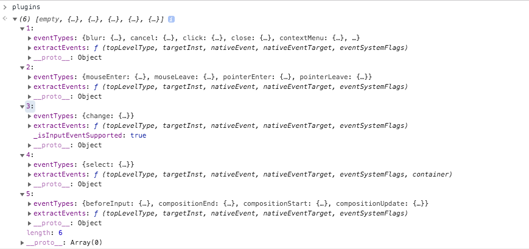
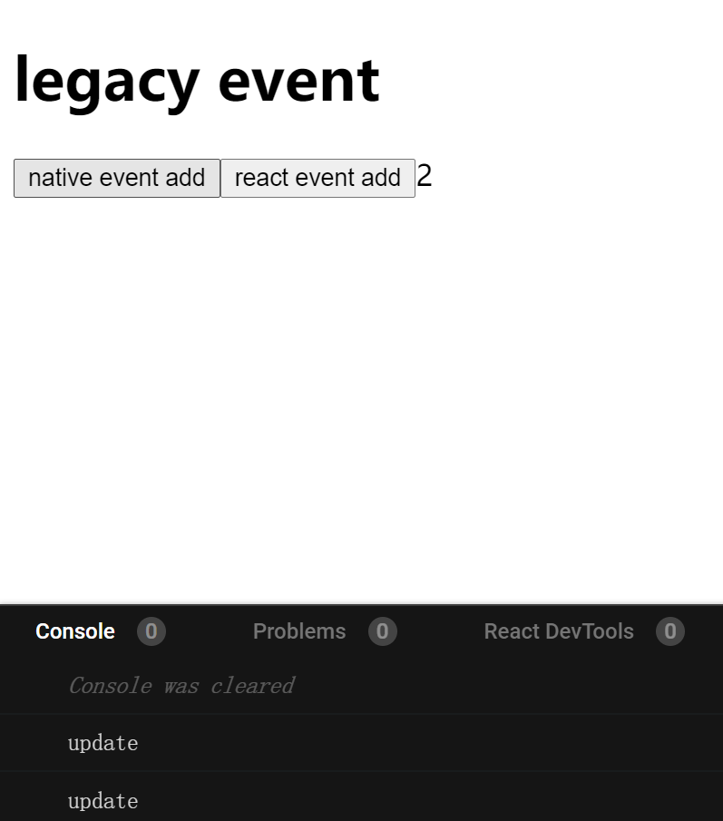
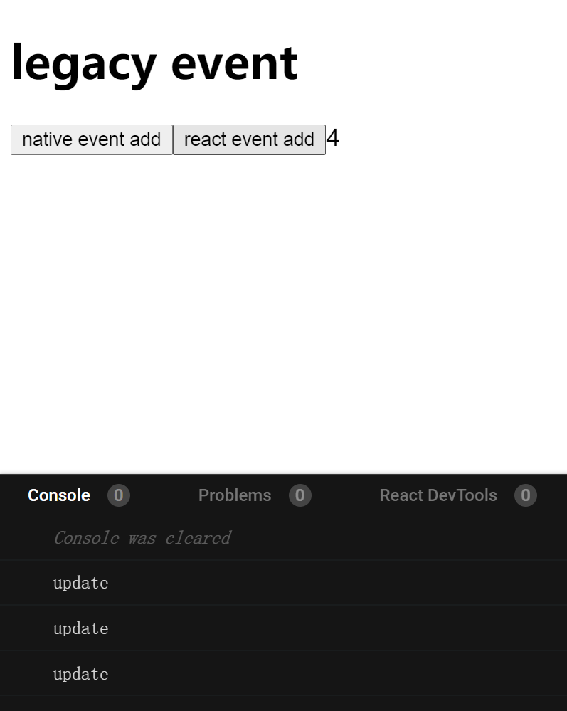
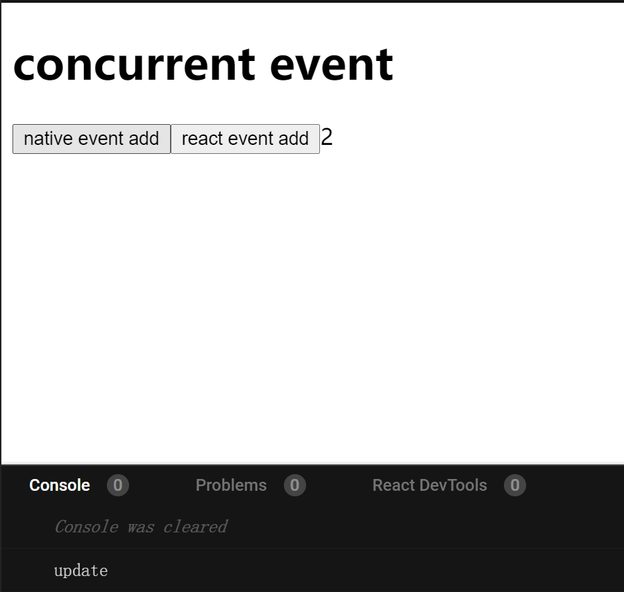

# 深入学习React合成事件

*以下分析基于React, ReactDOM 16.13.1版本*

## 提出问题

我们借鉴一个比较典型的案例开始来分析react事件

```js
export default class Dialog extends React.PureComponent {
  state = {
    showBox: false
  };
  componentDidMount() {
    document.addEventListener("click", this.handleClickBody, false);
  }
  handleClickBody = () => {
    this.setState({
      showBox: false
    });
  };
  handleClickButton = (e) => {
    e.nativeEvent.stopPropagation();
    this.setState({
      showBox: true
    });
  };
  render() {
    return (
      <div>
        <button onClick={this.handleClickButton}>点击我显示弹窗</button>
        {this.state.showBox && (
          <div onClick={(e) => e.nativeEvent.stopPropagation()}>我是弹窗</div>
        )}
      </div>
    );
  }
}
```

从上面的代码里我们不难看出我们想要做一个点击某一个按钮来展示一个模态框，并且在点击除了模态框区域以外的位置希望能够关闭这个模态框。
但是实际运行结果和我们所想的完全不一样，点击了button按钮并没有任何反应，这就需要从react的合成事件说起了，让我们分析完react的合成事件
后能够完全的来解答这个问题。

demo地址：https://codesandbox.io/s/event-uww15?file=/src/App.tsx:0-690

## 合成事件的特性

React自行实现了一套事件系统，主要特性有以下
  1. 自行实现了一套事件捕获到事件冒泡的逻辑, 抹平各个浏览器之前的兼容性问题。
  2. 使用对象池来管理合成事件对象的创建和销毁，可以减少垃圾回收次数，防止内存抖动。
  3. 事件只在document上绑定，并且每种事件只绑定一次，减少内存开销。

首先我们先抛开上面那个按钮，用下面这个十分简单的案例来了解React的事件使用。

```js
function App() {
  function handleButtonLog(e: React.MouseEvent<HTMLButtonElement>) {
    console.log(e.currentTarget);
  }
  function handleDivLog(e: React.MouseEvent<HTMLDivElement>) {
    console.log(e.currentTarget);
  }
  function handleH1Log(e: React.MouseEvent<HTMLElement>) {
    console.log(e.currentTarget);
  }
  return (
    <div onClick={handleDivLog}>
      <h1 onClick={handleH1Log}>
        <button onClick={handleButtonLog}>click</button>
      </h1>
    </div>
  );
}
```

上面的代码运行后，会在控制台中分别打印出，`button, h1, div`三个dom节点，我们来研究一下他是如何工作的。

## 事件绑定

首先来确认事件是如何绑定到dom节点上的，我们知道App组件内的jsx代码会通过React.CreateElement函数返回jsx对象，其中我们的onClick事件是储存在每一个jsx对象的props属性内，通过一系列方法得知在React在reconciliation阶段中会把jsx对象转换为fiber对象，这里有一个方法叫做completeWork，

```js
function completeWork(current, workInProgress, renderExpirationTime) {
    // 只保留关键代码
    case HostComponent:
      {
        popHostContext(workInProgress);
        var rootContainerInstance = getRootHostContainer();
        var type = workInProgress.type;
        if (current !== null && workInProgress.stateNode != null) {
          // 更新
        } else {
          // 创建
          if (_wasHydrated) {
            // ssr情况
          } else {
            var instance = createInstance(type, newProps, rootContainerInstance, currentHostContext, workInProgress);

            // 初始化DOM节点
            if (finalizeInitialChildren(instance, type, newProps, rootContainerInstance)) {
            }
          }
        }
}

```

这个函数内通过createInstance创建dom实例，并且调用finalizeInitialChildren函数，在finalizeInitialChildren函数中会把props设置到真实的dom节点上，这里如果遇到类似onClick，onChange的props时，会触发事件绑定的逻辑。

```js
// 进行事件绑定
ensureListeningTo(rootContainerElement, propKey);

function ensureListeningTo(rootContainerElement, registrationName) {
  // 忽略无关代码
  var doc = isDocumentOrFragment ? rootContainerElement : rootContainerElement.ownerDocument;
  legacyListenToEvent(registrationName, doc);
}
```

在ensureListeningTo函数中会通过实际触发事件的节点，去寻找到它的document节点，并且调用legacyListenToEvent函数来进行事件绑定


```js
function legacyListenToEvent(registrationName, mountAt) {
  var listenerMap = getListenerMapForElement(mountAt);
  var dependencies = registrationNameDependencies[registrationName];

  for (var i = 0; i < dependencies.length; i++) {
    var dependency = dependencies[i];
    legacyListenToTopLevelEvent(dependency, mountAt, listenerMap);
  }
}
```
registrationNameDependencies数据结构如图
<image src="../image/registrationNameDependencies.png" width="600" />

在legacyListenToEvent函数中首先通过获取document节点上监听的事件名称Map对象，然后去通过绑定在jsx上的事件名称，例如onClick来获取到真实的事件名称，例如click，依次进行legacyListenToTopLevelEvent方法的调用

```js
function legacyListenToTopLevelEvent(topLevelType, mountAt, listenerMap) {
  // 只保留主逻辑
  // 相同的事件只绑定一次
  if (!listenerMap.has(topLevelType)) {
    switch (topLevelType) {
      // 根据事件类型进行捕获或者冒泡绑定
      case TOP_SCROLL:
        trapCapturedEvent(XX);
      default:
        trapBubbledEvent(topLevelType, mountAt)
        break;
    }

    listenerMap.set(topLevelType, null);
  }
}
// 无论是trapBubbledEvent还是trapCapturedEvent都是调用trapEventForPluginEventSystem
// 区别就是第三个参数是ture还是false用来对应addEventListener中的第三个参数
function trapBubbledEvent(topLevelType, element) {
  trapEventForPluginEventSystem(element, topLevelType, false);
}
function trapCapturedEvent(topLevelType, element) {
  trapEventForPluginEventSystem(element, topLevelType, true);
}
```

legacyListenToTopLevelEvent函数做了以下两件事
1. 是否在document上已经绑定过原始事件名，已经绑定过则直接退出，未绑定则绑定结束以后把事件名称设置到Map对象上，再下一次绑定相同的事件时直接跳过。
2. 根据事件是否能冒泡来来进行捕获阶段的绑定或者冒泡阶段的绑定。

```js
function trapEventForPluginEventSystem(container, topLevelType, capture) {
  var listener;

  switch (getEventPriorityForPluginSystem(topLevelType)) {
    case DiscreteEvent:
      listener = dispatchDiscreteEvent.bind(null, topLevelType, PLUGIN_EVENT_SYSTEM, container);
      break;

    case UserBlockingEvent:
      listener = dispatchUserBlockingUpdate.bind(null, topLevelType, PLUGIN_EVENT_SYSTEM, container);
      break;

    case ContinuousEvent:
    default:
      listener = dispatchEvent.bind(null, topLevelType, PLUGIN_EVENT_SYSTEM, container);
      break;
  }

  var rawEventName = getRawEventName(topLevelType);

  if (capture) {
    addEventCaptureListener(container, rawEventName, listener);
  } else {
    addEventBubbleListener(container, rawEventName, listener);
  }
}
```

到目前为止我们已经拿到了真实的事件名称和绑定在事件的哪个阶段，剩下就还有一个监听事件本身了，这一步会在trapEventForPluginEventSystem函数内被获取到,他会通过事件的优先级来获取不同的监听事件，这部分会和调度方面有相关，我们只需要知道最终实际绑定的都是dispatchEvent这个监听事件，然后调用浏览器的addEventListener事件来绑定上dispatchEvent函数

到此为止事件的绑定暂时告一段落了，从上面能得出几个结论。
1. 事件都是绑定在document上的。
2. jsx中的事件名称会经过处理，处理后的事件名称才会被绑定，例如onClick会使用click这个名称来绑定。
3. 不管用什么事件来绑定， 他们的监听事件并不是传入jsx的事件函数，而是会根据事件的优先级来绑定dispatchDiscreteEvent,dispatchUserBlockingUpdate或者dispatchEvent三个监听函数之一，但是最终在触发事件调用的还是dispatchEvent事件。

## 事件触发
从事件绑定得知我们点击的button按钮的时候，触发的回调函数并不是实际的回调函数，而是dispatchEvent函数，
所以我们通常会有几个疑问
1. 它是怎么获取到用户事件的回调函数的？
2. 为什么在合成事件对象不能被保存下来，而需要调用特殊的函数才能保留？
3. 合成事件是怎么创建出来的？

```js
function dispatchEventForLegacyPluginEventSystem(topLevelType, eventSystemFlags, nativeEvent, targetInst) {
  var bookKeeping = getTopLevelCallbackBookKeeping(topLevelType, nativeEvent, targetInst, eventSystemFlags);
  try {
    batchedEventUpdates(handleTopLevel, bookKeeping);
  } finally {
    releaseTopLevelCallbackBookKeeping(bookKeeping);
  }
}
```

接下来的分析中我们就来解决这几个问题，首先看到dispatchEvent函数,忽略掉其他分支会发现实际调用的是dispatchEventForLegacyPluginEventSystem函数, 他首先通过callbackBookkeepingPool中获取一个bookKeeping对象，然后调用handleTopLevel函数，在调用结束的时候吧bookKeeping对象放回到callbackBookkeepingPool中，实现了内存复用。

*bookKeeping对象的结构如图*

<image src="../image/bookkeeping.png" />


```js
// 忽略分支代码，只保留主流程
function handleTopLevel(bookKeeping) {
  var targetInst = bookKeeping.targetInst;
  var ancestor = targetInst;
  do {
    var tag = ancestor.tag;
    if (tag === HostComponent || tag === HostText) {
      bookKeeping.ancestors.push(ancestor);
    }
  } while (ancestor);

  for (var i = 0; i < bookKeeping.ancestors.length; i++) {
    targetInst = bookKeeping.ancestors[i];

    runExtractedPluginEventsInBatch(topLevelType, targetInst, nativeEvent, eventTarget, eventSystemFlags);
  }
}
```

在handleTopLevel函数内，通过首先把触发事件的节点如果是dom节点或者文字节点的话，那就把对应的fiber对象放入bookkeeping.ancestors的数组内，接下去依次获取bookKeeping.ancestors上的每一个fiber对象，通过runExtractedPluginEventsInBatch函数来创建合成事件对象。

```js
function runExtractedPluginEventsInBatch(topLevelType, targetInst, nativeEvent, nativeEventTarget, eventSystemFlags) {
  var events = extractPluginEvents(topLevelType, targetInst, nativeEvent, nativeEventTarget, eventSystemFlags);
  runEventsInBatch(events);
}
```

在runExtractedPluginEventsInBatch中会通过调用extractPluginEvents函数，在这个函数内通过targetInst这个fiber对象，从这个对象一直往上寻找，寻找有一样的事件绑定的节点，并且把他们的回调事件组合到合成事件对象上，这里先讨论事件触发的流程，所以先简单带过合成事件是如何生成的以及是如何去寻找到需要被触发的事件, 后面会详细的讲解合成事件，最后在拿到合成事件以后调用runEventsInBatch函数

```js
function runEventsInBatch(events) {
  forEachAccumulated(processingEventQueue, executeDispatchesAndReleaseTopLevel);
}
```

其中processingEventQueue是多个事件列表，我们这只有一个事件队列，forEachAccumulated它的目的是为了按照队列的顺序去执行多个事件，在我们的例子中其实就相当于*executeDispatchesAndReleaseTopLevel(processingEventQueue)*,接下来就是调用到executeDispatchesAndRelease，从名称就看出来他是首先执行事件，然后对事件对象进行释放

```js
var executeDispatchesAndRelease = function (event) {
  if (event) {
    executeDispatchesInOrder(event);
    if (!event.isPersistent()) {
      event.constructor.release(event);
    }
  }
};
```
代码很少，首先调用executeDispatchesInOrder来传入合成事件，在里面按照顺序去执行合成事件对象上的回调函数，如果有多个回调函数，在执行每个回调函数的时候还会去判断event.isPropagationStopped()的状态，之前有函数调用了合成事件的stopPropagation函数的话，就停止执行后续的回调，但是要注意的时候这里的*dispatchListeners[i]*函数并不是用户传入的回调函数，而是经过包装的事件，这块会在合成事件的生成中介绍，在事件执行结束后react还会去根据用户是否调用了event.persist()函数来决定是否保留这次的事件对象是否要回归事件池，如果未被调用，该事件对象上的状态会被重置，至此事件触发已经完毕。

## 合成事件的生成

从事件监听的流程中我们知道了合成事件是从extractPluginEvents创建出来的，那么看一下extractPluginEvents的代码

```js
function extractPluginEvents(topLevelType, targetInst, nativeEvent, nativeEventTarget, eventSystemFlags) {
  var events = null;
  for (var i = 0; i < plugins.length; i++) {
    var possiblePlugin = plugins[i];
    if (possiblePlugin) {
      var extractedEvents = possiblePlugin.extractEvents(topLevelType, targetInst, nativeEvent, nativeEventTarget, eventSystemFlags);
      if (extractedEvents) {
        events = accumulateInto(events, extractedEvents);
      }
    }
  }
  return events;
}
```
首先来了解一下plugins是个什么东西，由于react会服务于不同的平台，所以每个平台的事件会用插件的形式来注入到react中，例如浏览器就是ReactDOM中进行注入

```js
injectEventPluginsByName({
  SimpleEventPlugin: SimpleEventPlugin,
  EnterLeaveEventPlugin: EnterLeaveEventPlugin,
  ChangeEventPlugin: ChangeEventPlugin,
  SelectEventPlugin: SelectEventPlugin,
  BeforeInputEventPlugin: BeforeInputEventPlugin,
});
```

injectEventPluginsByName函数会通过一些操作把事件插件注册到plugins对象上，数据结构如图



所以会依次遍历plugin，调用plugin上的extractEvents函数来尝试是否能够生成出合成事件对象，在我们的例子中用的是click事件，那么它会进入到SimpleEventPlugin.extractEvents函数

```js
var SimpleEventPlugin = {
  extractEvents: function (topLevelType, targetInst, nativeEvent, nativeEventTarget, eventSystemFlags) {
    var EventConstructor;
    switch (topLevelType) {
      case TOP_KEY_DOWN:
      case TOP_KEY_UP:
        EventConstructor = SyntheticKeyboardEvent;
        break;

      case TOP_BLUR:
      case TOP_FOCUS:
        EventConstructor = SyntheticFocusEvent;
        break;

      default:
        EventConstructor = SyntheticEvent;
        break;
    }

    var event = EventConstructor.getPooled(dispatchConfig, targetInst, nativeEvent, nativeEventTarget);
    accumulateTwoPhaseDispatches(event);
    return event;
  }
};
```

这个函数是通过topLevelType的类型来获取合成事件的构造函数，例如代码中的SyntheticKeyboardEvent，SyntheticFocusEvent等都是SyntheticEvent的子类，在基础上附加了自己事件的特殊属性，我们的click事件会使用到SyntheticEvent这个构造函数，然后通过getPooled函数来创建或者从事件池中取出一个合成事件对象实例。然后在accumulateTwoPhaseDispatchesSingle函数中，按照捕获到冒泡的顺序来获取所有的事件回调

```js
function accumulateTwoPhaseDispatchesSingle(event) {
  if (event && event.dispatchConfig.phasedRegistrationNames) {
    traverseTwoPhase(event._targetInst, accumulateDirectionalDispatches, event);
  }
}

function traverseTwoPhase(inst, fn, arg) {
  var path = [];

  while (inst) {
    path.push(inst);
    inst = getParent(inst);
  }

  var i;

  for (i = path.length; i-- > 0;) {
    fn(path[i], 'captured', arg);
  }

  for (i = 0; i < path.length; i++) {
    fn(path[i], 'bubbled', arg);
  }
}

```

traverseTwoPhase函数会从当前的fiber节点通过return属性，找到所有的是原生DOM节点的fiber对象，然后推入到列表中，我们的例子中就是
[ButtonFiber, H1Fiber, DivFiber], 首先执行捕获阶段的循环，从后往前执行，接着从前往后执行冒泡的循环，对应了浏览器原始的事件触发流程，最后会往accumulateDirectionalDispatches函数中传入当前执行的fiber和事件执行的阶段。

```js
function listenerAtPhase(inst, event, propagationPhase) {
  var registrationName = event.dispatchConfig.phasedRegistrationNames[propagationPhase];
  return getListener(inst, registrationName);
}

function accumulateDirectionalDispatches(inst, phase, event) {
  var listener = listenerAtPhase(inst, event, phase);
  if (listener) {
    event._dispatchListeners = accumulateInto(event._dispatchListeners, listener);
    event._dispatchInstances = accumulateInto(event._dispatchInstances, inst);
  }
}
```

listenerAtPhase中首先通过原生事件名和当前执行的阶段（捕获，还是冒泡）去再去获取对应的props事件名称（onClick，onClickCapture），然后通过react事件名称去fiber节点上获取到相应的事件回调函数，最后拼接在合成对象的_dispatchListeners数组内，当全部节点运行结束以后_dispatchListeners对象上就会有三个回调函数[handleButtonLog, handleH1Log, handleDivLog]，这里的回调函数就是我们在组件内定义的真实事件的回调函数。

到此合成事件构造就完成了，主要做了三件事:

1. 通过事件名称去选择合成事件的构造函数，
2. 事件去获取到组件上事件绑定的回调函数设置到合成事件上的_dispatchListeners属性上，用于事件触发的时候去调用。
3. 还有就是在初始化的时候去注入平台的事件插件。


## 事件解绑

通常我们写事件绑定的时候会在页面卸载的时候进行事件的解绑，但是在React中，框架本身由于只会在document上进行每种事件最多一次的绑定，所以并不会进行事件的解绑。

## 批量更新

当然如果我们使用React提供的事件，而不是使用我们自己绑定的原生事件除了会进行事件委托以外还有什么优势呢？
再来看一个例子

```js
export default class EventBatchUpdate extends React.PureComponent<> {
  button = null;
  constructor(props) {
    super(props);
    this.state = {
      count: 0
    };
    this.button = React.createRef();
  }
  componentDidMount() {
    this.button.current.addEventListener(
      "click",
      this.handleNativeClickButton,
      false
    );
  }
  handleNativeClickButton = () => {
    this.setState((preState) => ({ count: preState.count + 1 }));
    this.setState((preState) => ({ count: preState.count + 1 }));
  };
  handleClickButton = () => {
    this.setState((preState) => ({ count: preState.count + 1 }));
    this.setState((preState) => ({ count: preState.count + 1 }));
  };
  render() {
    console.log("update");
    return (
      <div>
        <h1>legacy event</h1>
        <button ref={this.button}>native event add</button>
        <button onClick={this.handleClickButton}>react event add</button>
        {this.state.count}
      </div>
    );
  }
}

```
在线demo地址：https://codesandbox.io/s/legacy-event-kjngx?file=/src/App.tsx:0-1109



首先点击第一个按钮，发现有两个update被打印出，意味着被render了两次。



首先点击第二个按钮，只有一个update被打印出来。

会发现通过React事件内多次调用setState，会自动合并多个State，但是在原生事件绑定上默认并不会进行合并多个State，那么有什么手段能解决这个问题呢？

1. 通过batchUpdate函数来手动声明运行上下文。
```js
  handleNativeClickButton = () => {
    ReactDOM.unstable_batchedUpdates(() => {
      this.setState((preState) => ({ count: preState.count + 1 }));
      this.setState((preState) => ({ count: preState.count + 1 }));
    });
  };
```
在线demo地址：https://codesandbox.io/s/legacy-eventbatchupdate-smisq?file=/src/App.tsx:519-749


首先点击第一个按钮，只有一个update被打印出来。


首先点击第二个按钮，还是只有一个update被打印出来。

2. 启用concurrent mode的情况。（目前不推荐，未来的方案）
```js
import ReactDOM from "react-dom";

const root = ReactDOM.unstable_createRoot(document.getElementById("root"));
root.render(<App />);
```
在线demo地址：https://codesandbox.io/s/concurrentevent-9oxoi?file=/src/index.js:0-224

会发现不需要修改任何代码，只需要开启concurrent模式，就会自动进行setState的合并。



首先点击第一个按钮，只有一个update被打印出来。


首先点击第二个按钮，还是只有一个update被打印出来。

## React17中的事件改进

在最近发布的react17版本中，对事件系统了一些改动，和16版本里面的实现有了一些区别，我们就来了解一下17中更新的点。

1. 更改事件委托
 - 首先第一个修改点就是更改了事件委托绑定节点，在16版本中，React都会把事件绑定到页面的document元素上，这在多个react版本共存的情况下就会虽然某个节点上的函数调用了e.stopPropagation(),但还是会导致另外一个react版本上绑定的事件没有被阻止触发，所以在17版本中会把事件绑定到render函数的节点上。

2. 去除事件池
 - 17版本中移除了 “event pooling（事件池）“，这是因为 React 在旧浏览器中重用了不同事件的事件对象，以提高性能，并将所有事件字段在它们之前设置为 null。在 React 16 及更早版本中，使用者必须调用 e.persist() 才能正确的使用该事件，或者正确读取需要的属性。

3. 对标浏览器
 - onScroll 事件不再冒泡，以防止出现常见的混淆。
 - react 的 onFocus 和 onBlur 事件已在底层切换为原生的 focusin 和 focusout 事件。它们更接近 React 现有行为，有时还会提供额外的信息。
 - 捕获事件（例如，onClickCapture）现在使用的是实际浏览器中的捕获监听器。

## 问题解答

现在让我们回到最开始的例子中，来看这个问题如何被修复

 - 16版本修复方法一

```js
  handleClickButton = (e: React.MouseEvent) => {
    e.nativeEvent.stopImmediatePropagation();
    ...
  };
```

 我们知道react事件绑定的时刻是在reconciliation阶段，会在原生事件的绑定前，那么可以通过调用e.nativeEvent.stopImmediatePropagation();
 来进行document后续事件的阻止。

在线demo地址：https://codesandbox.io/s/v16fixevent1-wb8m7

 - 16版本修复方法二

  ```js
    window.addEventListener("click", this.handleClickBody, false);
  ```

  另外一个方法就是在16版本中事件会被绑定在document上，所以只要把原生事件绑定在window上，并且调用e.nativeEvent.stopPropagation();来阻止事件冒泡到window上即可修复。

在线demo地址：https://codesandbox.io/s/v16fixevent2-4e2b5

 - React17版本修复方法

  在17版本中react事件并不会绑定在document上，所以并不需要修改任何代码，即可修复这个问题。

在线demo地址：https://codesandbox.io/s/v17fixevent-wzsw5

## 总结
  我们通过一个经典的例子入手，自顶而下来分析React源码中事件的实现方式，了解事件的设计思想，最后给出多种的解决方案，能够在繁杂的业务中挑选最合适的技术方案来进行实践。